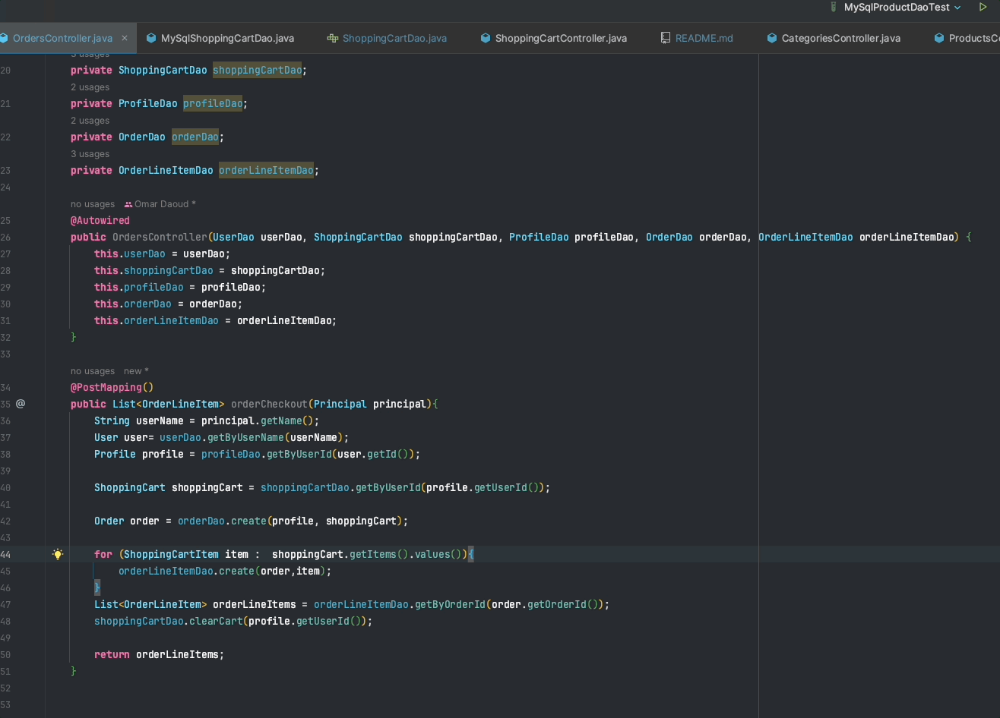

# Easy Shop Application

## Table of Contents

1. [Description](#Description)
2. [Features](#features)
3. [User Guide](#UserGuide)
4. [References](#References)
6. [Acknowledgments](#Ackknowledgments)

## Description

This e-commerce application for the Easy Company allows for easy browsing to give users a streamlined shopping experience.

## Features

- Allows users to browse a wide variety of products with the option to filter through them based on category, price, and color.
- Users can register for an account, log in, and update their profile settings.
- Able to add items to your shopping cart,empty the cart, and produce your order details when your checkout.
- Allows admin to get, create, update, and delete products and categories and products.

## Built With
_Frontend_

- HTML
- CSS (BootStrap)
- JavaScript

_Backend_
- Java JDK 17
- SpringBoot (FrameWork)

_Database_

- MySQL

_Testing_
- Postman

## User Guide

_REQUIREMENTS_

To run this application, you will need Java JDK 17, MySQL Workbench, and an IDE, such as IntelliJ.

_USAGE_

    1. Clone this repository on to your local machine
    2. Open it using an IDE and navigate to the database folder
    3. Run the provided script inside of MySql Workbench
    4. Run the EasyShopApplication File
    5. Start the frontend by navigating to the index.html and opening it in the browser
    6. Open Postman and run the tests provided in the postman collections folder

## Controllers
These controllers take care of our various API requests and include the methods and urls necessary to keep our application running.
### Categories Controller

### Products Controller

### ShoppingCart Controller

### Profile Controller

### Orders Controller

